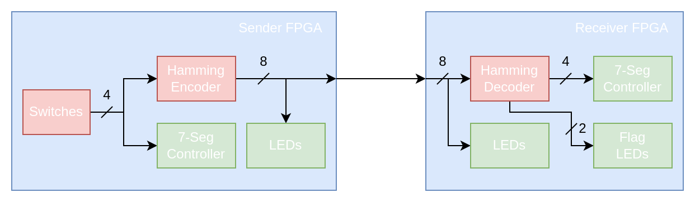

# Error Correction in Digital Systems
This repository contains relevant files for a project conducted in the context of the course *30111 - Engineering Pratices* held for 1. semester electrical engineering students at the Technical University of Denmark. The project offers an introduction to Hamming error correction codes. Connected materials can be found in another [repository](https://github.com/tjarker/error-correction-materials).

# Lab 1 - FPGA to FPGA transmission

In this first lab, you will design and implement a Hamming error correction code encoder and decoder. A single-error-corection-double-error-detection (SEC-DED) extension to the Hamming (7,4) error correction code will be used, where an eigth bit captures parity information of the whole message. The encoder and decoder will be used to transmit data between two different FPGAs. On the sender FPGA board, a 4-bit message entered via switches is encoded and sent by wires to the receiver FPGA board. Here the message is decoded and potential errors are signaled by LEDs. One LED signals an error (single or double), the other signals whether the error was corrected. Both FPGAs should agree on the original message, even if one wire is disconnected. A block diagram of the system is shown below:

Take some time to familiarize yourself with the project folder layout. VHDL hardware description files are inside the `src/designs` folder. VHDL testbenches are inside the `src/test` folder. The Vivado projects files for the sender and receiver board are located in the `projects/Sender` and `projects/Receiver` folders, respectively. Try to open both Vivado projects by locating their respecitve `.xpr` files.

## The encoder

This section guides you through the design, implementation and testing process of the Hamming SEC-DED encoder. First, the interface of the component has to be specified.

1. Look at the system block diagram as well as the [VHDL file](src/design/hamming/HammingEncoder.vhdl) for the encoder and make sure you understand the interface of the component. Draw the encoder as a block with its inputs and outputs to visualize the interface.

Now that the interface is determined, we know which outputs have to be calculated inside of the encoder.

2. Write down the logic expression for each output bit of the encoder.

With the logic expressions, we can build a gate circuit which implements the encoder.

3. Draw a circuit consisting of gates which implements the logic expressions.

On an FPGA, logic is implemented using programmable look-up tables (LUT). On the Basys 3, only LUTs with 6 inputs are available which can implement any boolean function of 6 arguments. 

4. Draw a circuit implementing the encoder using LUTs instead of gates.

We now have a clear idea of which circuit we want to implement. Before actually describing it in VHDL, we will create a testbench for the encoder such that we can be immediatly certain that our VHDL code matches what we intended to describe. A starting point of a testbench is provided in [HammingEncoderTb.vhdl](src/test/HammingEncoderTb.vhdl). The `check` function (see line 35) allows you to easily apply an input to the encoder as a first argument together with the expected encoder output as the second argument. Leave the remaining three arguments as they are. If the encoder outputs an unexpected value, the test produces an error. Since the encoder has only 16 input combinations, we can perform an exhaustive test, checking for each input that the output of our VHDL component is correct.

5. Create 16 copies of the `check` function call and fill in the expected encoded message for each possible input message. Run the testbench in Vivado in the Sender project and observe in the log at the bottom of the window that error messages are printed out. You will have to scroll up a few lines to be able to see them.

Now that we have an idea of which circuit we want to implement and a way of testing our hardware description, we can turn our attention to actually describing it in VHDL.

6. Describe your encoder implementation in the [HammingEncoder.vhdl](src/design/hamming/HammingEncoder.vhdl) file.

7. Run the testbench again and verify that your hardware description behaves as you expected.

Having verified that our design is correct, the last remaining step is to check whether it synthesizes without errors. Open the Sender Vivado project. The top entity for the sender FPGA board is called [SenderTop](src/design/SenderTop.vhdl). Notice that the interface of the top module is mapped to the FPGAs IO in the constraint file [Sender.xdc](projects/Sender/Sender.xdc).

8. Press *Run Implementation*. If no errors occur, the implementation process of the encoder is finished.

## The Decoder

This section will guide you through the same steps that were taken when designing the Hamming encoder. Again we will first focus on the interface of the component.

1. Look at the system block diagram as well as the [VHDL file](src/design/hamming/HammingDecoder.vhdl) for the decoder and make sure you understand the interface of the component. Draw the decoder as a block with its inputs and outputs to visualize the interface.

2. Write down the logic expression for each output bit of the decoder. This might be easier by introducing intermediate variables.

3. Draw a gate circuit implementing your logic expressions.

4. Draw a LUT circuit implementing your logic expressions.

Now it is again time to build a testbench as the final step before doing the actual hardware description. An empy testbench is provided in the [HammingDecoderTb.vhdl](src/test/HammingDecoderTb.vhdl) file. An exhaustive test is this time unrealistic without a way of automating the process, since `2^8 = 256` input combinations would have to be tested. Instead, you will come up with a set of representative test stimuli. This could for instance involve testing whether a bit flip can succesfully be detected and corrected at any position or that a double error is correctly detected. 

5. Develope 20 of such test cases and determine the expected behavior for each of them. Implement your test cases in the testbench and run it to make sure that there are no errors in the testbench.

We can now turn to describing the decoder in VHDL. VHDL allows us to describe at a gate level using boolean operators such as `and` and `xor` but it also allows for behavioral descriptions which use constructs such as `when`, `select`, `case` or `if` statements. Behavioral descriptions are often easier to read and understand and therefore preferable.

6. Consider whether part of your decoder could be more easily captured by a behavioral description than by your derived logic expressions.

7. Describe your decoder implementation in the [HammingDecoder.vhdl](src/design/hamming/HammingDecoder.vhdl) file using the results of the previous task.

8. Run the testbench again and verify that your hardware description behaves as you expected.

The last remaining step is to make sure that everything can be synthesized. Open the Receiver Vivado project. The top entity for the receiver FPGA is called [ReceiverTop](src/design/ReceiverTop.vhdl). The interface is again mapped to the FPGAs IO in the constraint file [Receiver.xdc](projects/Receiver/Receiver.xdc).

9. Press *Run Implementation*. If no errors occur, the implementation process of the encoder is finished.

## The Real World Test

Having successfully synthesized the sender as well as the receiver components, it is time for a real world test of the encoder and decoder. Generate a bit stream and program your Basys 3 board with either the sender or receiver component. Find another group with the opposite design programmed on their FPGA. Obtain 9 wires from the TA.

1. Look at the [Basys 3 reference manual](https://digilent.com/reference/programmable-logic/basys-3/reference-manual) and read the section concerning PMOD ports.
2. Locate the JB PMOD port on the sender FPGA.
3. Locate the JA PMOD port on the receiver FPGA.
4. Connect the ground PMOD pins of both FPGAs.
5. Connect the 8 data pins of both PMOD ports together.

The four rightmost switches on the sender FPGA control the message which is sent. Its hexadecimal representation is shown on the seven segment display of the FPGA. The encoded message is shown by the LEDs of the FPGA board.

On the receiver FPGA, the received eight bits are shown on the eight rightmost LEDs. The leftmost LED indicates whether an error has been detected (single or double). The adjacent LED indicates whether the error could be corrected. The decoded message is shown in hexadecimal on the seven segment display.

1. First verify that messages are sent correctly between the boards with all wires connected.
2. Now start to remove single wires and observe the reaction of the circuit. Does it indicate that and error occurred? If not why?
3. Remove two wires and observe the reaction of the circuit. Does it indicate a double error? Change the message on the sender FPGA. Does the receiver FPGAs output change?
